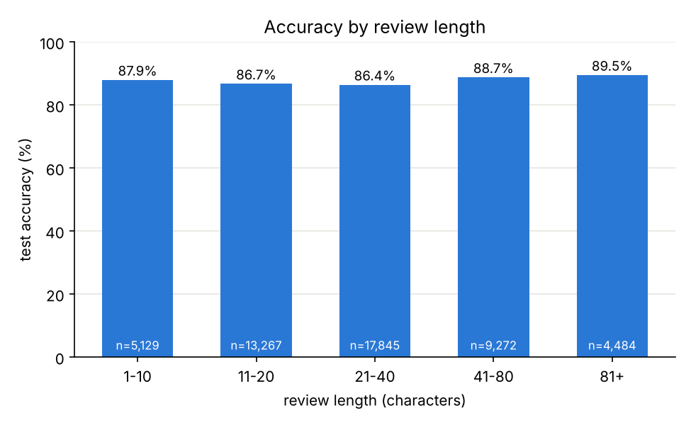

# Korean movie review sentiment

Classifies Korean movie reviews as positive or negative. Trained on the [Naver Sentiment Movie Corpus](https://github.com/e9t/nsmc) (150,000 training reviews, 50,000 test reviews).

| Model | Test accuracy | F1 |
|---|---|---|
| Naive Bayes, written by hand | 85.35% | 0.853 |
| Logistic regression on TF-IDF | **87.34%** | 0.873 |

Both models use character n-grams and no Korean tokenizer. Training takes under a minute on a CPU.

```
$ python predict.py "이 영화 진짜 재밌다" "시간 아깝다 돈 아깝다" "배우들 연기는 좋았는데 스토리가 너무 지루했다"
positive 96.7%  이 영화 진짜 재밌다
negative 100.0%  시간 아깝다 돈 아깝다
negative 99.8%  배우들 연기는 좋았는데 스토리가 너무 지루했다
```

(*"This movie is really fun"*, *"Waste of time, waste of money"*, *"The acting was good but the story was too boring"*)

## Why characters and not words

Korean attaches particles and endings to the word stem, so one word shows up in many surface forms: 재밌다, 재밌네요, 재밌었어요 are all "fun". Online reviews also skip spaces and misspell freely. Splitting on spaces therefore gives a huge, sparse vocabulary where most forms are seen once or twice.

The usual fix is a morphological analyser such as KoNLPy. This project takes the simpler route of character n-grams: every run of 1 to 3 characters is a feature, so 재밌 is shared by all three forms above, and spacing stops mattering.

Measured on 15,000 training reviews held out for validation ([`experiments.py`](experiments.py)):

| Features | Naive Bayes | Logistic regression | Feature count |
|---|---|---|---|
| Words (split on spaces) | 82.23% | 81.55% | 64,684 |
| Characters, 1-2 | 84.23% | | 70,605 |
| **Characters, 1-3** | **86.01%** | **87.59%** | 295,756 |
| Characters, 2-4 (NB) / 1-4 (LR) | 86.55% | 87.77% | about 680,000 |

Characters beat words by 4 to 6 points. Going from 3 to 4 characters more than doubles the feature count for under half a point, so the final models use 1 to 3.

## The models

**Naive Bayes** ([`naive_bayes.py`](naive_bayes.py)) is about 45 lines of NumPy. For each class it counts how often each n-gram appears, applies Laplace smoothing, and stores log probabilities. A review's score for a class is the log prior plus the sum of the log probabilities of its n-grams. [`test_naive_bayes.py`](test_naive_bayes.py) checks it against a worked example small enough to do on paper and against scikit-learn's `MultinomialNB`, which it matches exactly.

**Logistic regression** is scikit-learn's, on TF-IDF weighted n-grams with sublinear term frequency. It does better than Naive Bayes because it does not assume n-grams are independent. Overlapping n-grams such as 재미, 미없 and 재미없 are obviously correlated, and Naive Bayes counts that evidence three times.

## What the model learned

The n-grams with the largest weights ([`results/analysis.txt`](results/analysis.txt)):

| Positive | | Negative | |
|---|---|---|---|
| 최고 | the best | 최악 | the worst |
| 10점 | 10 points | 노잼 | no fun (slang) |
| 루하지 | from 지루하지 않다, "not boring" | 재미없 | not fun |
| 수작, 명작 | fine work, masterpiece | 지루 | boring |
| 감동 | moving | 실망 | disappointing |
| 눈물 | tears | 아까 | from 아깝다, "a waste" |

Two of these are more interesting than the rest:

- **루하지 is strongly positive even though 지루 is strongly negative.** The three-character window catches the start of the negation in 지루하지 않다, so the model handles "not boring" without understanding grammar.
- **는 좋 and 은 좋 are negative even though 좋 ("good") is positive.** They come from sentences like 연기는 좋았는데..., "the acting was good, but...". The topic particle before 좋 signals that a complaint is coming.

## Where it fails



Reviews of 21 to 40 characters are the hardest (86.4%). The longest reviews are the easiest (89.5%), probably because they carry more evidence.

Looking at the mistakes the model was most confident about:

- **Negation outside the 3-character window.** 돈이 하나도 안 아까움 ("not a waste of money at all") is predicted negative. 아까 is a strong negative n-gram, and 안 ("not") plus 아까 is four characters with the space, so no single n-gram covers both.
- **Label noise.** Labels come from star ratings, not from the text. The test set has reviews saying 좋다 ("good") and 최고최고!! ("the best, the best!!") that are labelled negative. No text model can get these right, so the real ceiling on this dataset is below 100%.
- **Mixed reviews.** Not from the test set, but a sentence typed into `predict.py`: 재미없을 줄 알았는데 생각보다 괜찮네 ("I thought it would be boring, but it's better than expected") comes out positive at only 65%, because 재미없 pulls hard the other way.

One more thing about the data: 1,568 of the test reviews also appear word for word in the training set, mostly very short ones. Scored only on reviews not seen in training, accuracy is 87.29%, so the overlap is not inflating the result much.

## Run it

```
pip install -r requirements.txt
python test_naive_bayes.py   # check the Naive Bayes implementation
python train.py              # downloads the data on first run, trains, saves model.joblib
python predict.py "이 영화 진짜 재밌다"
python analyze.py            # top n-grams, accuracy by length, worst mistakes
python experiments.py        # the feature comparison table
```

## Files

| File | What it does |
|---|---|
| `naive_bayes.py` | Multinomial Naive Bayes from scratch |
| `data.py` | Downloads and loads NSMC |
| `experiments.py` | Compares word and character features on a validation split |
| `train.py` | Trains both final models and reports test metrics |
| `predict.py` | Classifies reviews from the command line |
| `analyze.py` | Top n-grams, accuracy by length, most confident mistakes |

## Limitations and next steps

- Bag-of-n-grams has no idea of word order beyond 3 characters, which is why longer-range negation breaks it.
- Fine-tuned Korean BERT models reach roughly 90% on this dataset. Closing that gap is the obvious next step, and this project is the baseline to compare against.
- The model only knows movie reviews. It has not been tested on other kinds of text.

## Data

NSMC by Lucy Park, released under CC0. The data is downloaded on first run and is not stored in this repository.
